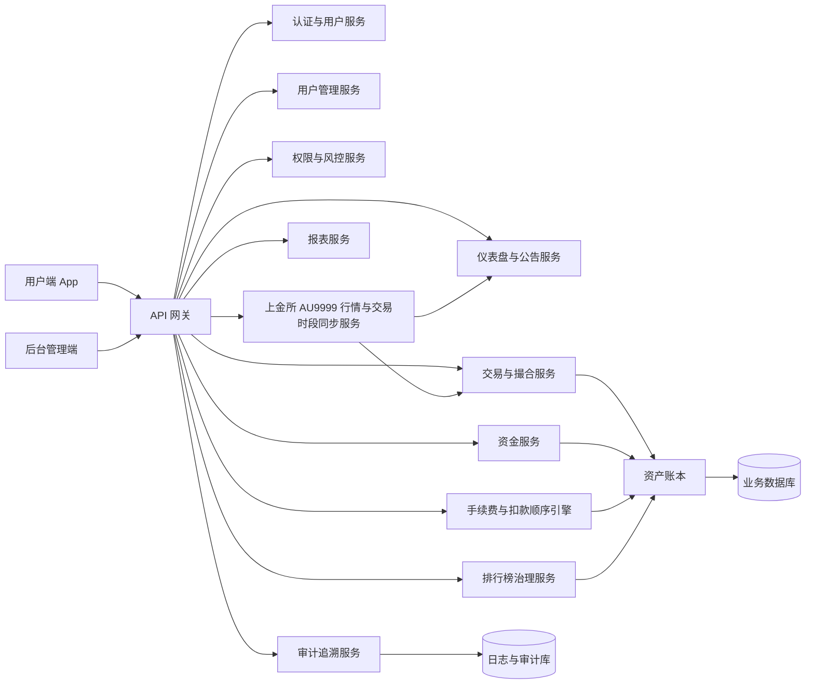

# 系统架构（前台+后台+账本）

## 1. 架构目标

围绕“后台模块职责清晰、数据归属稳定、充值自动入账、提现提交即冻结并人工确认、买卖自动撮合、点对点支付先增值后本金、统一手续费、全链路可审计”构建前后端一体架构。

## 2. 模块结构

## 3. 数据流

### 3.1 充值自动入账

1. 用户发起充值
2. 渠道支付流水写入系统
3. 资金服务自动写入充值订单和资金流水
4. 账本同步更新现金资产和总资产
5. 充值记录进入资金管理模块供对账查看
6. 审计服务记录 `traceId` 和哈希存证

### 3.2 提现冻结与人工确认

1. 用户提交提现申请
2. 系统立即冻结提现金额，并从暂定资产扣减，同时同步扣减总资产
3. 提现订单进入资金管理模块并按提交时间自动排队
4. 后台立即触发语音持续提醒，进入订单详情或手动静音后停止
5. 工作人员线下打款后点击确认提现完成，订单状态更新为 completed
6. 确认完成只做结案，不允许二次扣款；拒绝时执行解冻回补
7. 审计服务记录状态流转、提醒状态、操作日志和哈希

### 3.3 买卖撮合

1. 用户提交买单或卖单
2. 交易服务先校验上金所交易时段状态，再按价格优先、时间优先自动撮合
3. 成交后按统一费率 `0.1%` 计算 `feeRate`、`feeAmount`、`netAmount`
4. 成交后更新交易表、资产表、金链同步表
5. 异常同步写入同步队列，供交易管理模块重试
6. 审计服务记录 `traceId`、哈希和同步日志

### 3.4 点对点支付扣款与收款手续费

1. 支付服务读取付款方 `appreciationIncome` 与 `principalBalance`
2. 扣款顺序强制为先扣 `appreciationIncome`，不足部分再扣 `principalBalance`
3. 当支付动用本金时，`withdrawablePrincipal` 必须同步下降
4. 收款方手续费按 `1‰` 计算，阈值规则：`amount < 100` 不收
5. 支付单必须记录并返回：`appreciationUsed`、`principalUsed`、`receiverFeeRate`、`receiverFeeAmount`、`receiverNetAmount`
6. 全流程写入支付流水、资产流水、`traceId`、哈希与审计日志

### 3.5 上金所时段与行情自动同步

1. 系统自动同步上金所官方交易时段（Asia/Shanghai）：周一至周五 `09:00-11:30`、`13:30-15:30`、`20:00-次日02:30`
2. 周六、周日、法定节假日自动休市并关闭撮合入口
3. AU9999 行情自动同步上金所实时价格，无需人工干预
4. 同步状态写入监控与事件流，异常时触发告警和自动重试

### 3.6 仪表盘与公告

1. 仪表盘汇总用户、交易、资金、风控等模块指标
2. 系统监控汇总金链同步延迟、排行榜重排、支付对账
3. 实时事件流展示关键操作
4. 公告在后台发布后同步给前端首页轮播

## 4. 模块边界

1. 仪表盘只做总览、待办、监控、公告和规则提醒，不承接具体业务审核。
2. 用户管理聚焦用户生命周期和关联数据查询。
3. 交易管理聚焦买卖、撮合、同步、停盘、上金所交易时段自动同步控制。
4. 资金管理聚焦充值对账、提现审核、补款转账、资产调整、渠道对账。
5. 排行榜治理聚焦重排、规则配置、同步监控和异常处理。
6. 权限与风控聚焦角色权限、冻结拦截、提现拦截、风险预警。
7. 审计追溯聚焦 `traceId` 全链路和合规审计。
8. 报表中心聚焦多模块汇总、导出和可视化。
9. 手续费与扣款顺序引擎负责统一费率计算、先增值后本金策略、本金可提现额度联动。

## 5. 实时要求

1. 黄金参考价、当日买入克数、全站交易状态要在仪表盘自动刷新。
2. 系统监控和实时事件流要自动更新。
3. 公告发布后前端首页自动展示。
4. 排行榜同步异常和交易同步异常要实时可见。
5. 提现订单、提现提醒状态、资产冻结与解冻状态需要前后台秒级同步。
6. 点对点支付后，付款方与收款方资产、手续费与扣款拆分字段需要秒级同步。
