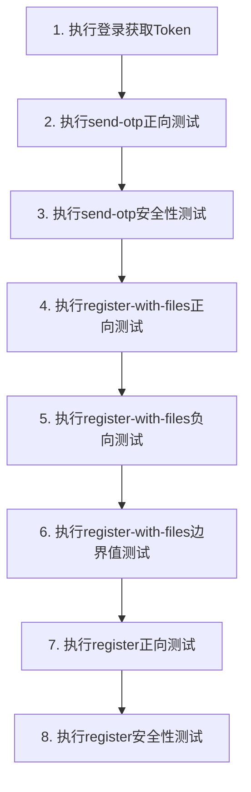

# Auth模块测试用例文档

## 测试范围
- `/auth/send-otp` - 发送短信验证码接口
- `/auth/register-with-files` - 文件注册接口
- `/auth/register` - JSON注册接口

---

## 一、正向测试用例

### 1.1 /auth/send-otp 正向测试

| 用例ID | 用例名称 | 测试场景 | 输入参数 | 预期结果 |
|--------|----------|----------|----------|----------|
| ZX-001 | 语义合法 | 使用有效Token发送验证码 | phone: "13800138000"<br>Headers: Authorization=Bearer {{validToken}} | HTTP 200<br>{"code": 200, "message": "验证码发送成功"} |

### 1.2 /auth/register-with-files 正向测试

| 用例ID | 用例名称 | 测试场景 | 输入参数 | 预期结果 |
|--------|----------|----------|----------|----------|
| ZX-005 | 仅传必要字段 | 只传必填字段完成注册 | username: "test_user_01"<br>password: "123456"<br>phone: "13800138001"<br>otpCode: "123456"<br>realName: "张三"<br>idNumber: "110101199003071234"<br>proofType: "workCert"<br>idCardFront: 文件<br>idCardBack: 文件<br>proofFile: 文件 | HTTP 200<br>{"code": 200, "data": {"uid": "..."}} |
| ZX-006 | 语义合法 | 完整参数正确格式注册 | username: "valid_user_01"<br>password: "Aa123456@#"<br>phone: "13912345678"<br>otpCode: "123456"<br>realName: "李四"<br>idNumber: "110101198512126789"<br>proofType: "workCert"<br>三个文件 | HTTP 200<br>注册成功 |
| ZX-007 | 覆盖枚举组合 | 测试不同proofType枚举值 | proofType: "bizLicense" | HTTP 200<br>注册成功 |

### 1.3 /auth/register 正向测试

| 用例ID | 用例名称 | 测试场景 | 输入参数 | 预期结果 |
|--------|----------|----------|----------|----------|
| ZX-008 | 其他正向 | JSON注册兼容模式 | username/password/phone/otpCode/realName | HTTP 200<br>注册成功 |

---

## 二、负向测试用例

### 2.1 /auth/send-otp 负向测试

| 用例ID | 用例名称 | 测试场景 | 输入参数 | 预期结果 |
|--------|----------|----------|----------|----------|
| ZX-002 | 缺失必填字段 | phone字段为空 | phone: "" | HTTP 400 |
| ZX-003 | 格式错误 | phone格式不正确(非11位) | phone: "12345" | HTTP 400 |

### 2.2 /auth/register-with-files 负向测试

| 用例ID | 用例名称 | 测试场景 | 输入参数 | 预期结果 |
|--------|----------|----------|----------|----------|
| FX-001 | 无效值 | proofType传入无效枚举值 | proofType: "invalid_type" | HTTP 400<br>"proofType must be one of..." |
| FX-002 | 缺失必填字段 | 缺少proofFile文件 | 不传proofFile | HTTP 400<br>"请上传完整实名资料" |
| FX-003 | 格式错误 | idNumber格式错误(非18位) | idNumber: "123456" | HTTP 400 |
| FX-004 | 类型错误 | phone传入数字类型 | phone: 13800138005 (数字) | HTTP 400 |
| FX-005 | 语义非法 | username已存在 | username: "test_user_01"(已注册) | HTTP 409<br>"账号或手机号已存在" |

---

## 三、边界值测试用例

### 3.1 /auth/send-otp 边界值测试

| 用例ID | 用例名称 | 测试场景 | 输入参数 | 预期结果 |
|--------|----------|----------|----------|----------|
| BJ-004 | Null零值空值 | phone为null | phone: null | HTTP 400 |

### 3.2 /auth/register-with-files 边界值测试

| 用例ID | 用例名称 | 测试场景 | 输入参数 | 预期结果 |
|--------|----------|----------|----------|----------|
| BJ-001 | 极大值极小值 | username最小长度(6位) | username: "a1b2c3" | HTTP 200 |
| BJ-002 | 超出最大最小边界 | username超过最大长度(18位) | username: "a1b2c3d4e5f6g7h8i9j0"(20位) | HTTP 400 |
| BJ-003 | Null零值空值 | realName为空字符串 | realName: "" | HTTP 400 |
| BJ-004 | 字符串过长过短 | password过短(小于6位) | password: "123"(3位) | HTTP 400 |

### 3.3 /auth/register 边界值测试

| 用例ID | 用例名称 | 测试场景 | 输入参数 | 预期结果 |
|--------|----------|----------|----------|----------|
| BJ-005 | 字符串过长过短 | realName过长(超过20位) | realName: "这是一个超过二十个字符的姓名测试"(22位) | HTTP 400 |

---

## 四、安全性测试用例

### 4.1 /auth/send-otp 安全性测试

| 用例ID | 用例名称 | 测试场景 | 输入参数 | 预期结果 |
|--------|----------|----------|----------|----------|
| AQ-001 | 鉴权控制-无Token | 请求头中缺失认证Token | 无Authorization头 | **HTTP 401**<br>"Unauthorized" |
| AQ-002 | 鉴权控制-无效Token | 使用无效的认证Token | Authorization: Bearer invalid_token_abc | **HTTP 401**<br>"Unauthorized" |
| AQ-003 | 鉴权控制-过期Token | 使用过期的认证Token | Authorization: Bearer {{expiredToken}} | **HTTP 401**<br>"Unauthorized" |

### 4.2 /auth/register 安全性测试

| 用例ID | 用例名称 | 测试场景 | 输入参数 | 预期结果 |
|--------|----------|----------|----------|----------|
| AQ-004 | SQL注入 | username包含SQL注入尝试 | username: "' OR '1'='1" | HTTP 400 |

---

## 测试环境配置

### 环境变量
| 变量名 | 值 | 说明 |
|--------|-----|------|
| baseUrl | http://localhost:3001/api | 后端API地址 |
| validToken | 登录成功后获取 | 有效的JWT Token |
| expiredToken | 已过期的JWT Token | 用于测试过期Token场景 |

### 测试数据准备
1. **用户账号**: test_user_01 / 123456 (用于登录获取Token)
2. **测试手机号**: 13800138000-13800138010 (确保未注册或已清理)
3. **身份证号**: 110101199003071234 (合法18位身份证格式)
4. **测试文件**: 
   - idCardFront.jpg (身份证正面示例图)
   - idCardBack.jpg (身份证反面示例图)
   - proofFile.pdf (工作证明示例文件)

---

## 测试执行顺序建议



---

## 测试通过标准

### 接口响应格式验证
```json
{
  "code": 200,        // HTTP状态码对应
  "message": "成功",   // 业务提示信息
  "data": {}          // 业务数据
}
```

### 通过条件
| 类型 | 通过标准 |
|------|----------|
| 正向用例 | HTTP状态码=200，业务code=200 |
| 负向用例 | HTTP状态码=400/409/422，message包含错误描述 |
| 边界值用例 | 边界内=200，边界外=400 |
| 安全性用例 | 鉴权失败=401，注入攻击=400 |

---

## 附录：参数校验规则

### send-otp 参数规则
| 参数 | 类型 | 必填 | 校验规则 |
|------|------|------|----------|
| phone | string | 是 | 11位手机号格式 |

### register-with-files 参数规则
| 参数 | 类型 | 必填 | 校验规则 |
|------|------|------|----------|
| username | string | 是 | 6-18位字符 |
| password | string | 是 | 6-16位字符 |
| phone | string | 是 | 11位手机号格式 |
| otpCode | string | 是 | 6位数字 |
| realName | string | 是 | 2-20位字符 |
| idNumber | string | 是 | 18位身份证格式 |
| proofType | string | 是 | 枚举值之一 |
| idCardFront | file | 是 | 图片文件 |
| idCardBack | file | 是 | 图片文件 |
| proofFile | file | 是 | 文件 |

### register 参数规则
| 参数 | 类型 | 必填 | 校验规则 |
|------|------|------|----------|
| username | string | 是 | 6-18位字符 |
| password | string | 是 | 6-16位字符 |
| phone | string | 是 | 11位手机号格式 |
| otpCode | string | 是 | 6位数字 |
| realName | string | 是 | 2-20位字符 |